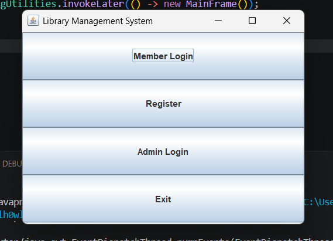
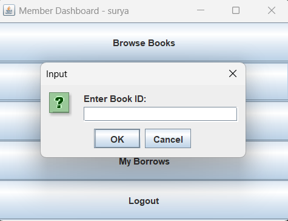
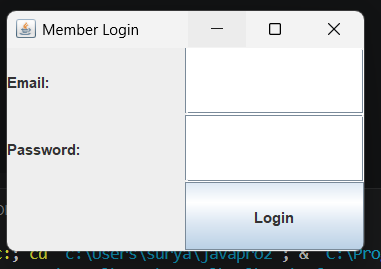
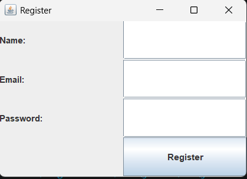
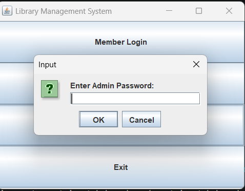

# 📚 Library Management System

A comprehensive Java-based library management application with a user-friendly Swing GUI, enabling members to register, browse books, manage borrowings, and allowing administrators to oversee the entire library inventory and borrow records in real-time.

## ✨ Features

### 👤 Member Module
- **User Registration** - Create new member accounts with email and password
- **Member Login** - Secure authentication with email and password verification
- **Browse Books** - View complete library catalog with title, author, genre, and availability
- **Borrow Books** - Reserve available books with automatic 14-day due date calculation
- **Return Books** - Check in borrowed books and update inventory
- **View History** - Track all past and current borrowings with dates and status
- **Dashboard** - Personalized member control center with quick actions

### 🔐 Admin Module
- **Add Books** - Add new books to inventory with title, author, genre, and quantity
- **View All Books** - Monitor complete book inventory with availability status
- **View All Borrows** - Track all member borrowing activities across the system
- **Password Protected** - Secure admin access with password authentication (admin123)
- **Real-time Updates** - Automatic inventory adjustments on borrow/return operations

## 🛠️ Tech Stack
- **Language**: Java (JDK 21)
- **Database**: MySQL 8.0
- **Database Driver**: JDBC (MySQL Connector/J)
- **GUI Framework**: Java Swing (AWT Layout Managers)
- **IDE**: VS Code with Extension Pack for Java
- **Architecture Pattern**: DAO (Data Access Object) + Service Layer

## 🏗️ Project Architecture

### Folder Structure
```
src/
 ├── dto/        → Data Transfer Objects (MemberDTO, BookDTO, BorrowRecordDTO)
 ├── dao/        → DAO Interfaces (MemberDAO, BookDAO, BorrowDAO)
 ├── daoimpl/    → JDBC Implementations (MemberDAOImpl, BookDAOImpl, BorrowDAOImpl)
 ├── service/    → Business Logic (MemberService, BookService, BorrowService, AdminService)
 ├── db/         → Database Connection (DBConnection)
 ├── ui/         → Swing UI Frames (MainFrame, LoginFrame, DashboardFrame, etc.)
 └── main/       → Application Entry Point (LibraryMain)

lib/             → External Libraries (MySQL JDBC Driver)
```

### Architecture Flow
```
MemberDTO/BookDTO/BorrowRecordDTO
    ↓
DAO Interface (MemberDAO, BookDAO, BorrowDAO)
    ↓
DAOImpl (JDBC Implementation - Direct Database Operations)
    ↓
Service Layer (Business Logic & Data Processing)
    ↓
UI Frames (Swing GUI - User Interaction)
```

## 🗄️ Database Schema

The application uses MySQL with the following schema:

### Members Table
```sql
CREATE TABLE members (
    member_id INT PRIMARY KEY AUTO_INCREMENT,
    name VARCHAR(100),
    email VARCHAR(100) UNIQUE,
    password VARCHAR(100)
);
```

### Books Table
```sql
CREATE TABLE books (
    book_id INT PRIMARY KEY AUTO_INCREMENT,
    title VARCHAR(200),
    author VARCHAR(100),
    genre VARCHAR(100),
    total_copies INT DEFAULT 1,
    available_copies INT DEFAULT 1
);
```

### Borrow Records Table
```sql
CREATE TABLE borrow_records (
    record_id INT PRIMARY KEY AUTO_INCREMENT,
    member_id INT,
    book_id INT,
    borrow_date DATE,
    due_date DATE,
    return_date DATE,
    status VARCHAR(20),
    FOREIGN KEY (member_id) REFERENCES members(member_id),
    FOREIGN KEY (book_id) REFERENCES books(book_id)
);
```

## ⚙️ Setup Instructions

### Prerequisites
- **JDK 17 or higher** (tested with JDK 21)
- **MySQL 8.0** server running locally
- **VS Code** with Extension Pack for Java
- **MySQL Connector/J JAR** file for JDBC driver

### Installation Steps

1. **Clone the Repository**
   ```bash
   git clone https://github.com/yourusername/library-management-system.git
   cd javapro2
   ```

2. **Create Database and Schema**
   - Open MySQL Workbench or MySQL CLI
   - Run the `schema.sql` file to create the database and tables:
   ```bash
   mysql -u root -p < schema.sql
   ```

3. **Configure Database Connection**
   - Open `src/db/DBConnection.java`
   - Update the password field with your MySQL root password:
   ```java
   private static final String PASS = "your_mysql_password";
   ```

4. **Add MySQL JDBC Driver**
   - Download MySQL Connector/J (8.0 or higher) from [MySQL Downloads](https://dev.mysql.com/downloads/connector/j/)
   - Extract the JAR file and place it in the `lib/` folder
   - File should be named: `mysql-connector-java-8.x.x.jar`

5. **Compile the Project**
   ```bash
   .\build.ps1
   ```
   Or manually:
   ```bash
   javac -d bin -cp "lib\*" src\**\*.java
   ```

6. **Run the Application**
   ```bash
   .\run.ps1
   ```
   Or manually:
   ```bash
   java -cp "bin;lib\*" main.LibraryMain
   ```

## 📸 Screenshots

| Main Menu | Member Dashboard | Browse Books |
|-----------|-----------------|--------------|
|  |  |  |

| Member Login | Register Member | Admin Dashboard |
|-------------|-----------------|-----------------|
|  |  |  |

## 🔑 Default Credentials

| Role | Email | Password |
|------|-------|----------|
| Admin | N/A | `admin123` |
| Member | Register via UI | Your choice during registration |

## 🧠 Key Implementation Highlights

- **Duplicate Booking Prevention** - System checks book availability before allowing borrowing
- **Automatic Inventory Management** - Available copies automatically decrement on borrow and increment on return
- **Secure Password Verification** - Uses BINARY comparison for case-sensitive password matching
- **Auto-calculated Due Dates** - Due date automatically set to 14 days from borrow date using `java.time.LocalDate`
- **Generated Record IDs** - Uses `Statement.RETURN_GENERATED_KEYS` to return auto-incremented record IDs
- **Try-with-Resources** - All database operations use try-with-resources for automatic connection/statement closure
- **Exception Handling** - Comprehensive error handling with user-friendly error messages via JOptionPane
- **Service Layer Pattern** - Business logic separated from database operations for maintainability

## 🚀 Future Enhancements

- 🔐 **Password Hashing** - Implement BCrypt or PBKDF2 for secure password storage
- 🔍 **Advanced Search** - Filter and search books by title, author, or genre
- 💰 **Overdue Fine Calculation** - Automatic fine calculation for late returns
- 📧 **Email Notifications** - Send borrowing confirmations and due date reminders
- 🌐 **REST API** - Convert to Spring Boot REST API for web/mobile integration
- 🎨 **Modern UI** - Migrate from Swing to JavaFX for modern interface
- 📊 **Analytics Dashboard** - Generate reports on borrowing trends and popular books
- 🔄 **Book Reservations** - Allow members to reserve unavailable books
- ⭐ **Book Ratings** - Members can rate and review borrowed books

## 🐛 Troubleshooting

### MySQL Driver Not Found
- Ensure `mysql-connector-java-8.x.x.jar` is in the `lib/` folder
- Verify classpath includes `-cp "bin;lib\*"` during compilation and execution

### Database Connection Failed
- Check MySQL server is running
- Verify credentials in `DBConnection.java`
- Ensure database `library_db` exists (run `schema.sql`)

### ClassNotFoundException Errors
- Recompile with `build.ps1`
- Delete `bin/` folder and rebuild: `Remove-Item -Recurse -Force bin`

### UI Frames Not Displaying
- Ensure Java Swing components are properly imported from `javax.swing.*` and `java.awt.*`
- Verify `SwingUtilities.invokeLater()` is used in `LibraryMain.java`

## 📝 License

This project is open source and available under the MIT License.

## 👨‍💻 Author

**Surya Patel**  
Java Developer | Library Management System

---

**Last Updated**: May 2, 2026  
**Version**: 1.0.0  
**Status**: ✅ Fully Functional
